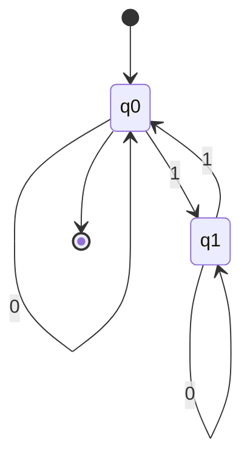
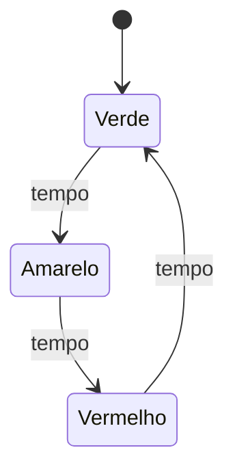
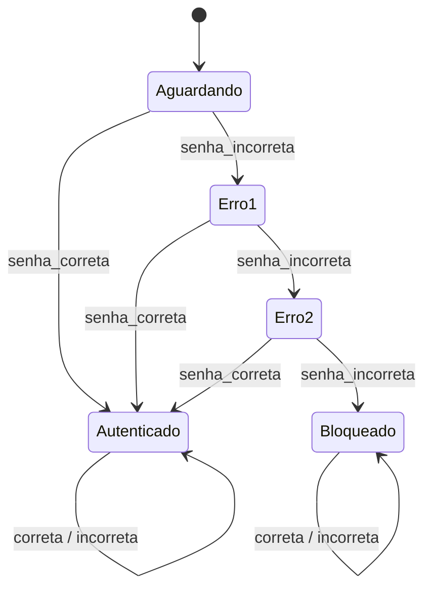

01/09/2026

# Lista de Exercícios — Autômatos Finitos Determinísticos (AFD)

> **Disciplina:** Teoria das Linguagens e Autômatos  
> **Tema:** Autômatos Finitos Determinísticos  
> **Modalidade:** Atividade prática em grupo  
> **Objetivo:** identificar, interpretar, construir e testar AFDs.

---

## Identificação do grupo

| Campo | Preenchimento |
|---|---|
| Turma |     Ciência da Computação - N1            |
|  Data |            01/09/2026                     |
| Integrante 1 | Filipe Pedais Carvalho             |
| Integrante 2 | Guilherme Rodrigues de Almeida     |
| Integrante 3 | Paulo Henrique de Melo Loiola      |
| Integrante 4 | Pedro Henrique Sipriano Cavalcante |
| Integrante 5 | Rodrigo Damasceno Santos           |

## Orientações

- Registre o raciocínio utilizado em cada resposta.
- Nos exercícios com cadeias, apresente o caminho percorrido estado por estado.
- Nos exercícios de construção, entregue a quíntupla, a tabela de transição e o diagrama.
- Use `ε` para representar a cadeia vazia.
- Quando solicitado, implemente e teste o autômato no JFLAP.

---

# Parte 1 — Fundamentos

## Exercício 1 — Entendendo um autômato finito

Uma lâmpada controlada por um interruptor possui os estados `Desligado` e `Ligado`. Sempre que o botão é pressionado, ocorre a mudança:

```text
Desligado --pressionar--> Ligado
Ligado    --pressionar--> Desligado
```

Responda:

1. Quantos estados existem?
   
   R: Dois estados. Ligado e Desligado.
2. Qual é o estado inicial, considerando que a lâmpada começa apagada?
   
   R: O estado inicial é desligado.
3. Qual entrada provoca uma transição?
   
   R: Pressionar
4. Partindo de `Desligado`, qual será o estado após um acionamento?
   
   R: O próximo estado será Ligado.
5. Partindo de `Desligado`, qual será o estado após dois acionamentos?
    
   R: Após dois acionamentos, o estado estará em Desligado novamente.
6. Explique o funcionamento do sistema com suas palavras.
    
   R: O sistema recebe um estado inicial, se o estado for desligado ao ser pressionado o estado muda para ligado. Já quando o sistema está com o
      estado igual a ligado, ao ser pressionado seu estado é alterado para desligado. Funcionando como um interruptor. 

## Exercício 2 — Porta automática

Uma porta automática possui os estados `Fechado` e `Aberto`. O sensor identifica `pessoa_detectada` ou `nenhuma_pessoa`. Quando uma pessoa é detectada, a porta deve ficar aberta; quando ninguém é detectado, deve ficar fechada.

Complete a tabela:

| Estado atual | Entrada | Próximo estado |
|---|---|---|
| Fechado | pessoa_detectada | Aberto |
| Fechado | nenhuma_pessoa | Fechado |
| Aberto | pessoa_detectada | Aberto |
| Aberto | nenhuma_pessoa | Fechado |

Depois, desenhe o diagrama de estados correspondente e indique o estado inicial.

---

# Parte 2 — Anatomia e definição formal

## Exercício 3 — Identificando os elementos

Considere um AFD com `Σ = {0,1}`, `Q = {q0,q1}`, estado inicial `q0`, estado final `q1` e as transições abaixo:

| δ | 0 | 1 |
|---|---|---|
| q0 | q0 | q1 |
| q1 | q0 | q1 |

Identifique e explique:

1. o alfabeto `Σ`;

   **R:** $\Sigma = \{0, 1\}$. Representa o conjunto finito de símbolos de entrada que a máquina pode ler.

2. o conjunto de estados `Q`;

   **R:** $Q = \{q0, q1\}$. É o conjunto finito de todas as etapas ou situações possíveis do autômato.

3. o estado inicial;

   **R:** $q0$ ($q0 \in Q$). Indica o estado onde o processamento de qualquer cadeia é iniciado.

4. o conjunto de estados finais `F`;

   **R:** $F = \{q1\}$ ($F \subseteq Q$). Representa o conjunto de estados que determinam a condição de aceitação da cadeia.

5. os símbolos que podem ser lidos;

   **R:** $0$ e $1$. São os caracteres pertencentes ao alfabeto $\Sigma$ que disparam as transições de estado.

6. o significado do círculo duplo em um diagrama;

   **R:** Identifica visualmente um estado final (de aceitação).

7. o significado da seta sem origem apontando para um estado.

   **R:** Indica qual estado é o estado inicial ($q0$) do autômato.


## Exercício 4 — A quíntupla do AFD

Um AFD é formalmente representado por:

```text
M = (Σ, Q, δ, q0, F)
```

Complete:

| Elemento | Significado |
|---|---|
| `Σ` | Alfabeto de símbolos de entrada |
| `Q` | Conjunto finito de estados do autômato |
| `δ` | Função de transição |
| `q0` | Estado inicial |
| `F` | Conjunto de estados finais ou de aceitação |

Explique por que esses cinco elementos são suficientes para definir o funcionamento de um AFD.

**R:** Esses elementos cobrem todo o funcionamento do autômato sem deixar nenhuma dúvida. Eles informam onde o processo começa (q0), quais símbolos a máquina consegue ler (Σ), quais situações ela pode assumir (Q), a regra exata de como mudar de estado a cada leitura (δ) e como decidir se a palavra digitada foi aceita ou rejeitada no final (F)

# Parte 3 — Tabela de transições e cadeias

## Exercício 5 — Interpretando uma tabela

Considere `Σ = {0,1}`, `Q = {q0,q1,q2}`, estado inicial `q0`, `F = {q1}` e:

| δ | 0 | 1 |
|---|---|---|
| q0 | q0 | q1 |
| q1 | q2 | q1 |
| q2 | q1 | q1 |

Responda:

1. Qual é o resultado de `δ(q0,0)`?


**R:** `δ(q0,0)` = q0 cruzando a linha do $q_0$ com a coluna do $0$ o gente cai nele mesmo.

3. Qual é o resultado de `δ(q0,1)`?


**R:** `δ(q0,1)` = $q_1$ Linha do $q_0$ cruzando com a coluna do $1$.

4. Qual é o resultado de `δ(q1,0)`?


**R:** `δ(q1,0)` = $q_2$ Utiliza a mesma lógica, linha do $q_1$ com a coluna do $0$

5. Qual é o resultado de `δ(q2,1)`?


**R:** `δ(q2,1)` = $q_3$ Linha $q_2$ cruzando com a coluna $1$.

6. Qual é o estado de aceitação?


`F = {q1}`
Estado de aceitação e $q_1$

6. Desenhe o diagrama correspondente à tabela.


| Estado | Entrada | Próximo estado |
| ------ | ------- | -------------- |
| q0     | 0       | q0             |
| q0     | 1       | q1             |
| q1     | 0       | q2             |
| q1     | 1       | q1             |
| q2     | 0       | q1             |
| q2     | 1       | q1             |

7. Justifique por que o autômato é determinístico.


**R:** Ele é determinístico porque, para cada estado e cada símbolo de entrada (0 ou 1), existe apenas uma opção de caminho. Ou seja, o autômato sempre sabe exatamente para qual estado deve ir.

## Exercício 6 — Aceita ou rejeita?

Utilize o AFD do Exercício 5. Determine se cada cadeia é aceita ou rejeitada:

```text
a) 1
b) 0011001
c) 010010
d) 1101
e) 000011010
```

Para cada cadeia, registre todas as transições. Exemplo:

```text
Cadeia: 01
q0 --0--> q0
q0 --1--> q1
Estado final: q1
Resultado: ACEITA
```

| Cadeia | Caminho percorrido | Estado final | Resultado |
|---|---|---|---|
| `1` | | | |
| `0011001` | | | |
| `010010` | | | |
| `1101` | | | |
| `000011010` | | | |

---

# Parte 4 — Construção de AFDs

## Exercício 7 — Cadeias que terminam em `1`

Construa um AFD sobre `Σ = {0,1}` que reconheça todas as cadeias que terminam em `1`.

- Devem ser aceitas: `1`, `01`, `101`, `0001`, `1101`.
- Devem ser rejeitadas: `ε`, `0`, `10`, `100`, `1110`.

Entregue: conjunto de estados, alfabeto, estado inicial, estados finais, tabela, diagrama e teste de pelo menos cinco cadeias.

R =
A. Conjunto de estados

Q={q0,q1} Q={q0,q1}
•	q0q0: estado inicial, usado quando a cadeia está vazia ou termina em 00;
•	q1q1: estado final, usado quando a cadeia termina em 11.

B. Alfabeto

Σ={0,1} Σ={0,1}

C. Estado inicial

q0q0

D. Estados finais

F={q1} F={q1}

E. Função de transição

A função de transição é definida por:
•	Se for lido o símbolo 00, o autômato vai para q0q0;
•	Se for lido o símbolo 11, o autômato vai para q1q1.

F. Tabela de transições

Estado atual  q0 	

Entrada 0     q0

Entrada 1     q1

G. Diagrama do AFD


                 1
          ┌─────────────┐
          │             ▼
       → (q0) ──1──> ((q1))
          ▲             │
          │             │ 1
          └─────0───────┘
          
       (q0) --0--> (q0)
       (q1) --0--> (q0)
       (q1) --1--> (q1)


Uma representação mais detalhada:

                 1
          ┌─────────────┐
          │             │
          │             ▼
       → (q0) ────────> ((q1))
          ▲               │
          │               │
          └────── 0 ──────┘

Laços:
- q0 --0--> q0
- q1 --1--> q1


Laços:
- q0 --0--> q0
- q1 --1--> q1

H. O estado q1q1 é representado com dois círculos porque é o estado final.

| Cadeia | Caminho percorrido | Resultado |
| --- | --- | --- |
| 111 | q0→1q1q_0 \\xrightarrow{1} q_1q0​1​q1​ | Aceita |
| 010101 | q0→0q0→1q1q_0 \\xrightarrow{0} q_0 \\xrightarrow{1} q_1q0​0​q0​1​q1​ | Aceita |
| 101101101 | q0→1q1→0q0→1q1q_0 \\xrightarrow{1} q_1 \\xrightarrow{0} q_0 \\xrightarrow{1} q_1q0​1​q1​0​q0​1​q1​ | Aceita |
| 000100010001 | q0→0q0→0q0→0q0→1q1q_0 \\xrightarrow{0} q_0 \\xrightarrow{0} q_0 \\xrightarrow{0} q_0 \\xrightarrow{1} q_1q0​0​q0​0​q0​0​q0​1​q1​ | Aceita |
| 110111011101 | q0→1q1→1q1→0q0→1q1q_0 \\xrightarrow{1} q_1 \\xrightarrow{1} q_1 \\xrightarrow{0} q_0 \\xrightarrow{1} q_1q0​1​q1​1​q1​0​q0​1​q1​ | Aceita |
| ε\\varepsilonε | Permanece em q0q_0q0​ | Rejeita |
| 000 | q0→0q0q_0 \\xrightarrow{0} q_0q0​0​q0​ | Rejeita |
| 101010 | q0→1q1→0q0q_0 \\xrightarrow{1} q_1 \\xrightarrow{0} q_0q0​1​q1​0​q0​ | Rejeita |
| 100100100 | q0→1q1→0q0→0q0q_0 \\xrightarrow{1} q_1 \\xrightarrow{0} q_0 \\xrightarrow{0} q_0q0​1​q1​0​q0​0​q0​ | Rejeita |
| 111011101110 | q0→1q1→1q1→1q1→0q0q_0 \\xrightarrow{1} q_1 \\xrightarrow{1} q_1 \\xrightarrow{1} q_1 \\xrightarrow{0} q_0q0​1​q1​1​q1​1​q1​0​q0​ | Rejeita |


I. O AFD aceita exatamente as cadeias que terminam em 1, pois somente o estado q1 é final. Sempre que o último símbolo lido for 1, o autômato estará em q1. Quando o último símbolo for 0, o autômato retornará para q0, que não é um estado final.


## Exercício 8 — Número par de símbolos `1`

Construa um AFD sobre `Σ = {0,1}` que reconheça cadeias com quantidade par de símbolos `1`.

Analise: `ε`, `0`, `1`, `11`, `101`, `1100` e `10101`.

Apresente a definição formal `M = (Σ, Q, δ, q0, F)`, a tabela, o diagrama e o processamento das cadeias. Lembre-se de que basta controlar duas situações: quantidade par ou ímpar de símbolos `1`.


R = 

Definição formal


M = (\Sigma, Q, \delta, q_0, F)

onde:
- \Sigma = \{0, 1\}
- Q = \{q_0, q_1\}
- \delta: Q \times \Sigma \rightarrow Q
- q_0$ = estado inicial
- F = \{q_0\}

Função de transição \delta

| $\delta$ | 0 | 1 |
|----------|---|---|
| $q_0$ | $q_0$ | $q_1$ |
| $q_1$ | $q_1$ | $q_0$ |

Definição explícita:
- \delta(q_0, 0) = q_0
- \delta(q_0, 1) = q_1
- \delta(q_1, 0) = q_1
- \delta(q_1, 1) = q_0

Interpretação: $q_0$ representa quantidade par de 1s; q_1 representa quantidade ímpar de 1s.

Diagrama de estados



Processamento das cadeias

| Cadeia | Sequência de transições | Estado final | Aceita? |
|--------|-------------------------|--------------|---------|
| $\varepsilon$ | $q_0$ | $q_0$ | ✓ |
| $0$ | $q_0 \xrightarrow{0} q_0$ | $q_0$ | ✓ |
| $1$ | $q_0 \xrightarrow{1} q_1$ | $q_1$ | ✗ |
| $11$ | $q_0 \xrightarrow{1} q_1 \xrightarrow{1} q_0$ | $q_0$ | ✓ |
| $101$ | $q_0 \xrightarrow{1} q_1 \xrightarrow{0} q_1 \xrightarrow{1} q_0$ | $q_0$ | ✓ |
| $1100$ | $q_0 \xrightarrow{1} q_1 \xrightarrow{1} q_0 \xrightarrow{0} q_0 \xrightarrow{0} q_0$ | $q_0$ | ✓ |
| $10101$ | $q_0 \xrightarrow{1} q_1 \xrightarrow{0} q_1 \xrightarrow{1} q_0 \xrightarrow{0} q_0 \xrightarrow{1} q_1$ | $q_1$ | ✗ |

Conclusão: O AFD aceita cadeias com quantidade par (incluindo zero) de símbolos 1.


## Exercício 9 — Pelo menos dois zeros consecutivos


Construa um AFD para:

```text
L(M) = {w ∈ {0,1}* | w possui pelo menos dois 0s consecutivos}
```

- Devem ser aceitas: `00`, `001`, `100`, `1001`, `110011`, `0000`.
- Devem ser rejeitadas: `ε`, `0`, `1`, `01`, `10`, `10101`.

Responda antes de construir:

1. O que o estado inicial representa?
2. O que ocorre quando aparece o primeiro `0`?
3. O que ocorre quando outro `0` aparece imediatamente depois?
4. Depois de encontrar `00`, a cadeia pode deixar de ser aceita?
5. Quantos estados são necessários?

Apresente a quíntupla, a tabela, o diagrama e os testes.

R = 


# Exercício 9 — Pelo menos dois zeros consecutivos

Construa um AFD sobre o alfabeto
|\Sigma = \{0,1\}| que reconheça a linguagem:

|
L(M) = \{w \in \{0,1\}^{*} \mid w \text{ possui pelo menos dois zeros consecutivos}\}
|

A expressão “dois zeros consecutivos” significa que a cadeia contém a substring 00.

---
1. Análise prévia

O que o estado inicial representa?

O estado inicial |q_0| representa que a cadeia ainda não contém dois zeros consecutivos. Isso inclui:

- nenhuma ocorrência de 0;
- o último símbolo lido não é 0;
- a cadeia está vazia.

O que ocorre quando aparece o primeiro 0?

Ao ler o primeiro 0, o autômato vai para |q_1|. Esse estado indica que o último símbolo lido foi 0, mas ainda não foi encontrada a sequência 00.

O que ocorre quando outro 0 aparece imediatamente depois?

Se o autômato estiver em |q_1| e ler outro 0, significa que foi encontrada a sequência 00. Nesse caso, ele vai para |q_2|.

Depois de encontrar 00, a cadeia pode deixar de ser aceita?

Não. Depois que a sequência 00 é encontrada, a cadeia continuará sendo aceita, independentemente dos símbolos que aparecerem depois. Por isso, |q_2| possui laços com 0 e 1.

### Quantos estados são necessários?

São necessários três estados:

- |q_0|: nenhum 00 foi encontrado e o último símbolo não é 0;
- |q_1|: o último símbolo lido foi um único 0;
- |q_2|: a sequência 00 já foi encontrada.

---

2. Definição formal do AFD

O autômato finito determinístico é definido pela quíntupla:

|
M = (\Sigma, Q, \delta, q_0, F)
|

com:

|
\Sigma = \{0,1\}
|

|
Q = \{q_0,q_1,q_2\}
|

|
F = \{q_2\}
|

O estado inicial é |q_0|.

Portanto:

|
M = (\{0,1\},\{q_0,q_1,q_2\},\delta,q_0,\{q_2\})
|

Significado dos estados

| Estado | Significado |
|---|---|
| |q_0| | A sequência 00 ainda não foi encontrada e o último símbolo não é 0 |
| |q_1| | O último símbolo lido foi 0, mas ainda não há 00 |
| |q_2| | A sequência 00 já foi encontrada |

---

3. Função de transição

A função de transição é:

|
\delta: Q \times \Sigma \rightarrow Q
|

As transições são:

|
\delta(q_0,0)=q_1
|

|
\delta(q_0,1)=q_0
|

|
\delta(q_1,0)=q_2
|

|
\delta(q_1,1)=q_0
|

|
\delta(q_2,0)=q_2
|

|
\delta(q_2,1)=q_2
|

---


4. Tabela de transições


| Estado | Lê `0` | Lê `1` | Descrição |
|---|---|---|---|
| |\rightarrow q_0| | |q_1| | |q_0| | Ainda não encontrou 00 |
| |q_1| | |q_2| | |q_0| | Acabou de ler um 0 |
| |*q_2| | |q_2| | |q_2| | Já encontrou 00 |

Legenda:

- |\rightarrow|: estado inicial;
- |*|: estado final.

---

5. Diagrama de estados


q0: ainda não foi encontrada a sequência 00;
q1: o último símbolo lido foi 0;
q2: a sequência 00 foi encontrada; estado final.


O estado |q_2| é final porque representa que a cadeia já possui pelo menos dois zeros consecutivos.

---

6. Testes das cadeias aceitas

Cadeia 00

|
q_0 \xrightarrow{0} q_1 \xrightarrow{0} q_2
|

Estado final: |q_2|

Resultado: aceita

---

Cadeia 001

|
q_0 \xrightarrow{0} q_1
\xrightarrow{0} q_2
\xrightarrow{1} q_2
|

Estado final: |q_2|

Resultado: aceita

---

Cadeia 100

|
q_0 \xrightarrow{1} q_0
\xrightarrow{0} q_1
\xrightarrow{0} q_2
|

Estado final: |q_2|

Resultado: aceita

---

Cadeia 1001

|
q_0 \xrightarrow{1} q_0
\xrightarrow{0} q_1
\xrightarrow{0} q_2
\xrightarrow{1} q_2
|

Estado final: |q_2|

Resultado: aceita

---

Cadeia 110011

|
q_0 \xrightarrow{1} q_0
\xrightarrow{1} q_0
\xrightarrow{0} q_1
\xrightarrow{0} q_2
\xrightarrow{1} q_2
\xrightarrow{1} q_2
|

Estado final: |q_2|

Resultado: aceita

---

Cadeia 0000

|
q_0 \xrightarrow{0} q_1
\xrightarrow{0} q_2
\xrightarrow{0} q_2
\xrightarrow{0} q_2
|

Estado final: |q_2|

Resultado: aceita

---

7. Testes das cadeias rejeitadas

Cadeia |\varepsilon|

|
q_0
|

Estado final: |q_0|

Resultado: rejeita

---

Cadeia 0

|
q_0 \xrightarrow{0} q_1
|

Estado final: |q_1|

Resultado: rejeita

---

Cadeia 1

|
q_0 \xrightarrow{1} q_0
|

Estado final: |q_0|

Resultado: **rejeita**

---

Cadeia 01

|
q_0 \xrightarrow{0} q_1
\xrightarrow{1} q_0
|

Estado final: |q_0|

Resultado: **rejeita**

---

Cadeia 10

|
q_0 \xrightarrow{1} q_0
\xrightarrow{0} q_1
|

Estado final: |q_1|

Resultado: **rejeita**

---

Cadeia 10101

|
q_0 \xrightarrow{1} q_0
\xrightarrow{0} q_1
\xrightarrow{1} q_0
\xrightarrow{0} q_1
\xrightarrow{1} q_0
|

Estado final: |$q_0$|

Resultado: rejeita


---

8. Resumo dos testes

| Cadeia | Estado final | Resultado |
|---|---|---|
| 00 | |$q_2$| | Aceita |
| 001 | |$q_2$| | Aceita |
| 100 | |$q_2$| | Aceita |
| 1001 | |$q_2$| | Aceita |
| 110011 | |$q_2$| | Aceita |
| 0000 | |$q_2$| | Aceita |
| |\varepsilon| | |q_0| | Rejeita |
| 0 | |$q_1$| | Rejeita |
| 1 | |$q_0$| | Rejeita |
| 01 | |$q_0$| | Rejeita |
| 10 | |$q_1$| | Rejeita |
| 10101 | |$q_0$| | Rejeita |

---

## Conclusão

O AFD possui três estados e aceita exatamente as cadeias que contêm a sequência `00`, ou seja, pelo menos dois zeros consecutivos.

|
L(M)=\{w\in\{0,1\}^{*}\mid w\text{ contém a substring }00\}
|


---

# Parte 5 — Desafios de modelagem

## Exercício 10 — Semáforo

Modele um semáforo com os estados `Verde`, `Amarelo` e `Vermelho`. Use a entrada `tempo` e represente o ciclo:

```text
Verde → Amarelo → Vermelho → Verde
```

Entregue o diagrama, a tabela de transições, a definição formal e uma explicação do funcionamento. Discuta se há sentido em definir estados de aceitação nesse modelo e justifique a escolha adotada.

Resposta:

**1. Definição Formal:**
- **Estados ($Q$):** {Verde, Amarelo, Vermelho}
- **Alfabeto ($\Sigma$):** {tempo}
- **Estado Inicial ($q_0$):** Verde
- **Estados Finais ($F$):** $\emptyset$ (Nenhum)
- **Função de Transição ($\delta$):** Definida na tabela abaixo.

**2. Tabela de Transições:**
| Estado Atual | Entrada | Próximo Estado |
| :--- | :--- | :--- |
| Verde | tempo | Amarelo |
| Amarelo | tempo | Vermelho |
| Vermelho | tempo | Verde |

**3. Diagrama de Estados:**


**4. Explicação do Funcionamento:**
O semáforo é um modelo de sistema reativo cíclico. Ele inicia no estado `Verde` e, a cada pulso de entrada chamado `tempo` (que representa a passagem de uma unidade de tempo ou evento do *timer*), transita deterministicamente para o próximo estado lógico da sequência (Amarelo $
ightarrow$ Vermelho $
ightarrow$ Verde), repetindo o ciclo de forma infinita.

**5. Sobre Estados de Aceitação:**
**Não faz sentido** definir estados de aceitação neste modelo. Autômatos com estados de aceitação (como os reconhecedores de linguagem) são utilizados para avaliar se uma cadeia finita de caracteres possui estrutura válida ou não. Um semáforo é um sistema contínuo e infinito; ele não tem o objetivo de "aceitar" ou "rejeitar" uma sequência de passos, mas sim de garantir o controle contínuo dos estados ao longo do tempo.

## Exercício 11 — Sistema de login

Modele um sistema com as entradas `senha_correta` e `senha_incorreta`. Uma senha correta autentica o usuário; após três tentativas incorretas, o sistema fica bloqueado.

Determine:

1. todos os estados necessários para contar as tentativas;
2. o alfabeto de entrada;
3. o estado inicial;
4. os estados finais;
5. todas as transições;
6. o comportamento após a autenticação e após o bloqueio.

Responda: apenas os estados `Aguardando`, `Autenticado` e `Bloqueado` são suficientes para controlar três tentativas? Justifique e construa o AFD completo.

Resposta:

**1. Análise da Quantidade de Estados:**
Apenas os estados *Aguardando*, *Autenticado* e *Bloqueado* **não são suficientes**.
**Justificativa:** Um AFD não possui memória extra (como variáveis inteiras) além do seu próprio estado atual. Se usarmos apenas o estado "Aguardando", ele não terá como saber se o usuário está na primeira, segunda ou terceira tentativa incorreta ao permanecer nele. Precisamos criar estados intermediários explícitos para "contar" a quantidade de falhas.

**2. Elementos do AFD Completo:**
- **Alfabeto de Entrada ($\Sigma$):** {senha_correta, senha_incorreta}
- **Estados Necessários ($Q$):**
  - `Aguardando` (0 falhas)
  - `Erro1` (1 falha)
  - `Erro2` (2 falhas)
  - `Autenticado` (Sucesso)
  - `Bloqueado` (3 falhas)
- **Estado Inicial ($q_0$):** `Aguardando`
- **Estados Finais ($F$):** `{Autenticado}` (Podemos considerar "Autenticado" como o estado final/aceitação que atesta o sucesso).

**3. Tabela de Transições:**
| Estado Atual | senha_correta | senha_incorreta |
| :--- | :--- | :--- |
| **-> Aguardando** | Autenticado | Erro1 |
| **Erro1** | Autenticado | Erro2 |
| **Erro2** | Autenticado | Bloqueado |
| **\* Autenticado** | Autenticado | Autenticado |
| **Bloqueado** | Bloqueado | Bloqueado |

*Comportamento após autenticação/bloqueio:* Ambos atuam como estados "sorvedouros" (*trap states*). Uma vez que o sistema chegue em `Autenticado` ou `Bloqueado`, as próximas entradas são ignoradas e o estado não muda mais.

**4. Diagrama de Estados:**



---

# Parte 6 — Prática no JFLAP

## Exercício 12 — Implementação e testes

Escolha um dos AFDs dos exercícios 7, 8 ou 9 e implemente-o no JFLAP.

1. Crie os estados.
2. Defina o estado inicial e os estados finais.
3. Crie todas as transições.
4. Teste três cadeias que devem ser aceitas.
5. Teste três cadeias que devem ser rejeitadas.
6. Compare os resultados esperados e obtidos.

Inclua um print do AFD, a tabela de testes e uma breve explicação.

| Cadeia | Resultado esperado | Resultado no JFLAP | Conferência |
|---|---|---|---|
| | | | |
| | | | |
| | | | |
| | | | |
| | | | |
| | | | |


Resposta:

**Escolha:** Exercício 7 (Cadeias que terminam em 1). Foi escolhido por ser o modelo mais simples (apenas 2 estados) e direto de implementar, conforme solicitado.

**1. Configuração (Modelo implementado):**
- **Estados:** `q0`, `q1`
- **Estado inicial:** `q0`
- **Estado final:** `q1`
- **Transições criadas:**
  - `q0` lendo `0` $
ightarrow$ `q0`
  - `q0` lendo `1` $
ightarrow$ `q1`
  - `q1` lendo `0` $
ightarrow$ `q0`
  - `q1` lendo `1` $
ightarrow$ `q1`

**2. Print do AFD (Representação Estrutural):**
*(Como este é um arquivo de texto, a estrutura gráfica equivalente no JFLAP seria a seguinte)*
```text
      ( 0 )             ( 1 )
      +---+             +---+
      |   v             |   v
    +-------+   ( 1 )   +-------+
--> |  q0   | --------> | ((q1))|
    +-------+           +-------+
        ^                   |
        |       ( 0 )       |
        +-------------------+
```

**3. Tabela de Testes (Expected vs JFLAP):**

| Cadeia | Resultado esperado | Resultado no JFLAP | Conferência |
| :--- | :--- | :--- | :--- |
| **1** | Aceita | Accept | OK ✅ |
| **01** | Aceita | Accept | OK ✅ |
| **101** | Aceita | Accept | OK ✅ |
| **$ arepsilon$ (vazia)**| Rejeita | Reject | OK ✅ |
| **0** | Rejeita | Reject | OK ✅ |
| **10** | Rejeita | Reject | OK ✅ |

**4. Breve Explicação:**
Na implementação do JFLAP, criamos dois estados (`q0` e `q1`), definimos a seta de inicialização em `q0` e demarcamos `q1` com duplo círculo de aceitação. Ao utilizar a funcionalidade de *Multiple Run*, o JFLAP simulou a leitura dos símbolos um a um. 
Para as cadeias `1`, `01` e `101`, o último símbolo processado foi um `1`, ativando a transição para `q1` no fim da fita e retornando `Accept`. Para as cadeias vazia (`\epsilon`), `0` e `10`, o processamento encerrou no estado `q0` (estado comum), e o software retornou corretamente o resultado `Reject`. Os resultados obtidos correspondem em 100% à expectativa teórica.
---

# Desafio final

## Exercício 13 — Crie seu próprio problema

Escolha uma situação real representável por estados, como elevador, máquina de vendas, controle de acesso, estacionamento, pedido de delivery, semáforo, porta eletrônica ou protocolo de comunicação.

O grupo deverá:

1. descrever o problema e suas regras;
2. identificar as entradas e os estados;
3. definir o estado inicial e os estados finais;
4. criar a tabela de transições;
5. desenhar o AFD;
6. apresentar `M = (Σ, Q, δ, q0, F)`;
7. testar pelo menos cinco sequências de entrada;
8. explicar por que o modelo é determinístico;
9. apresentar uma conclusão sobre o que foi aprendido.

---

# Entregável

O grupo deverá entregar um único arquivo `README.md`, contendo:

- identificação do grupo;
- respostas dos exercícios indicados pela professora;
- diagramas e tabelas de transição;
- processamento estado por estado das cadeias;
- evidência dos testes no JFLAP;
- conclusão do grupo.

## Modelo para o desafio final

```markdown
## Desafio final

### Problema escolhido

### Estados e significado

### Alfabeto

### Estado inicial e estados finais

### Tabela de transições

### Diagrama

### Definição formal
M = (Σ, Q, δ, q0, F)

### Testes realizados
| Entrada | Resultado esperado | Resultado obtido |
|---|---|---|
| | | |

### Evidência no JFLAP

### Conclusão
```

> **Importante:** não basta apresentar o diagrama. Demonstre como o AFD processa cada cadeia, estado por estado, até decidir pela aceitação ou rejeição.

---

**Profa. Kadidja Valéria**

